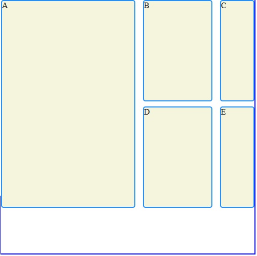

###### link to codecademy lesson

https://www.codecademy.com/courses/learn-intermediate-css/lessons/css-grid-essentials/exercises/introduction-to-grids

# GRID ESSENTIALS

## Introduction to Grids

Using CSS, you can elegantly lay out elements on a web page. There is no simple answer for how best to do this — depending on what content you are trying to display, multiple different techniques can work well. The Box Model and Display and Positioning explain some possible ways to style layout.

In this lesson, we introduce a powerful tool called CSS Grid. The grid can be used to layout entire web pages. Whereas Flexbox is mostly useful for positioning items in a one-dimensional layout, CSS grid is most useful for two-dimensional layouts, providing many tools for aligning and moving elements across both rows and columns.

By the end of this lesson, you will understand how to use these properties to create grid layouts:

1. grid-template-columns
2. grid-template-rows
3. grid-template
4. grid-template-area
5. row-gap / column-gap / gap
6. grid-row-start / grid-row-end
7. grid-column-start / grid-column-end
8. grid-area

That’s a lot to learn. But by the end, you’ll be a master at grid positioning. Let’s start learning!

###### NG:memory aid

/c/Users/glads/Documents/PROJECTS_AT_CODECADEMY/GRID_ESSENTIALS/lesson1_of_15_GRID_ESSENTIALS_Inroduction_to_Grids
